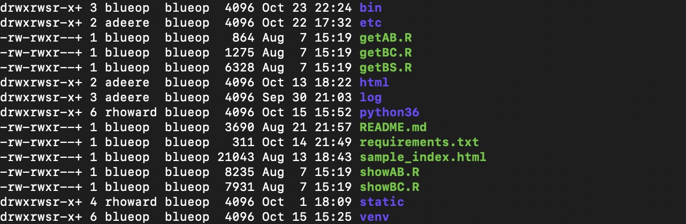
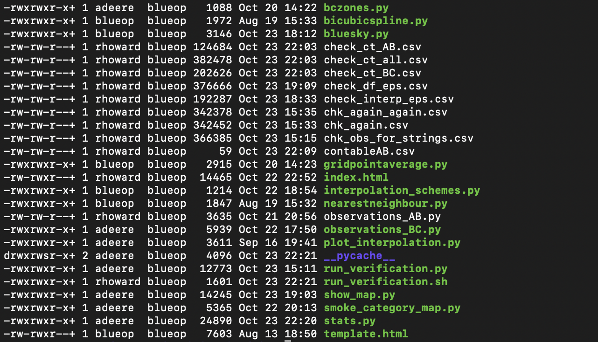
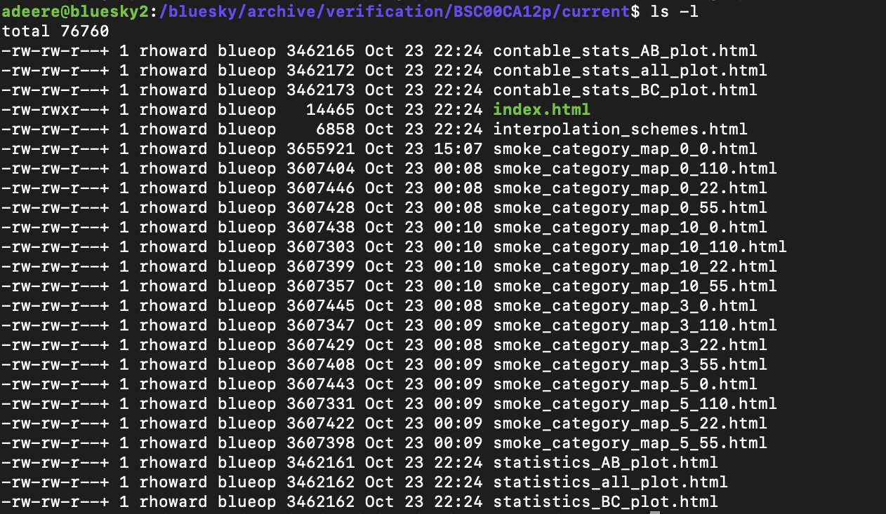

# **BlueSky Verification - Methodology**
In the summer of 2020 I was tasked with completing the verification of BlueSky Canada forecasts in quasi-real time that Tim Atkinson had started several months earlier. The three main parts of the site, which I will describe in detail below, are the Verification Map, Verification Statistics, and the Individual Station Traces. At the moment this is only operational for stations in British Columbia, but the hope is to expand that into Alberta and potentially other provinces if there is interest. 

## **Verification Map**
There is a map showing the absolute difference between PM2.5 in the BlueSky Canada forecast and the PM2.5 observed at stations throughout BC. It can be interpreted as how well the smoke forecast did at observation stations for different windows in time and space, currently in BC. 

## **Statistics**
These statistics are useful to analyze how well the forecast has done on any given day. There are 5 statistics shown for each day: the mean absolute error, the root mean squared error, the accuracy, the hit rate, and the false alarm rate.

## **Individual Station Traces**
The individual station verification displays the raw observations of PM2.5  and the BlueSky smoke forecast + background PM2.5 at all stations in British Columbia.

## **Example Run from BlueSky2 Command-line** 
1. cd bluesky/verification
2. source venv/bin/activate
3. cd bin
4. ./run_verification.sh 

Step 4. ./`run_verification.sh` runs the bash script which runs the control script with different combinations of time and spatial windows. This is the default that is run operationally. If you are interested in looking at other windows, forecast days, forecast start, etc. you can specify these with the following optional command-line flags: 
### **Optional Command-Line Flags for run_verification.py**

#### **Used operationally**
* —forecast_start
    * Start time for the forecast you are interested in. Example: 2020080108 (August 1st, 2020 at 8 am UTC)
    * Default value is yesterday.
    * It is used in `run_verification.py`.
    * Can be used to look at a specific forecast date. 
* —forecast_window
    * Define the length of the forecast that you would like to look at. 
    * Default value is 24 hours
    * Can be used to look at a different forecast window than default. 
    * It is used in `run_verification.py`.
* —time_window_input
    * Time window that you would like to look at (in hours).
    * Default value is 5 hours, but several are run operationally and are defined in run_verification.sh
    * Can be used to look at a specific time window other than default. 
    * It is used in the verification map on the webpage. The window is defined in `run_verification.py` and is used as time window input in `show_map.py` in the function llpad that calculates the model data in a window. 
* —spatial_window_input
    * Spatial window that you would like to look at (in degrees).
    * Default value is 0.5 degrees, but several are run operationally and are defined in run_verification.sh. 
    * Can be used to look at a specific spatial window other than default. 
    * It is used in the verification map on the webpage. The window is defined in run_verification.py and is used as spatial window input in show_map.py in the function llpad that calculates the model data in a window. 
* —log_level_string
    * Defines the level of logging you’d like to do.
    * Default is “info”.
    * It is used in `run_verification.py`.
* —log_directory_string
    * Change the output location (directory only!) of the log file.
    * Default is “”, but is defined below as /bluesky/verification/log
    * It is used in `run_verification.py`.
* —forecast_archive_string 
    * Change the forecast archive directory. 
    * Default is “”, but is defined in the control script as /bluesky/archive/forecast. 
    * It is used in `run_verification.py`.

#### **Not currently used operationally**
* —good_threshold_input
    * Number that defines a good forecast threshold (ug/m^3). 
    * Default value is 50 ug/m^3.
    * When the verification map’s absolute differences were defined as good, fair, and poor this threshold was defined to be the good value. Anything below this value was defined to be good. 
* —fair_threshold_input
    * Number that defines a fair forecast threshold (ug/m^3). 
    * Default value is 80 ug/m^3.
    * When the verification map’s absolute differences were defined as good, fair, and poor, this threshold was defined to be the fair value. Anything below this value and above the good_threshold_input was defined to be fair, and anything above was poor. 
* —smoke_event_threshold_input
    * Value that defines a smoke event (ug/m^3).
    * Default is 10 ug/m^3.
* —no_smoke_input
    * Value that defines what counts as smoke (ug/m^3)
    * Default is 0 ug/m^3.
    * This value is currently not being used operationally as the background smoke is defined throughout the scripts in different ways. It can be implemented if any individual would like to set a no_smoke_input again.

## **Files** 

Here I have included two screenshots of the file structure of /bluesky/verification (above) and /bluesky/verification/bin (below). 

There is a more technical description of these scripts (include output from each script and the input each script takes) here: https://docs.google.com/spreadsheets/d/1Lo1qohS7_955KUY1vjYAwYJE6Uu_0KNwLoEtdUQYsyY/edit#gid=0
### **Bash**  
* `run_verification.sh`
    * runs `run_verification.py` with combinations of time (hr) and spatial (km) windows
### **Config**
* `default.cfg`
    * config file
    * defines important links, directories, and the default logging level
### **Python**
* `run_verification.py`
    * control script
    * defines all command-line flags
    * sets up logging
    * sets up the symlink
    * executes plotting files, copies html files into the output directories 
* `bluesky.py`
    * grabs bluesky model data from directory defined in the command-line flags or the default in run_verification.py. An example filename is: /bluesky/archive/forecasts/BSC00CA12p/2020081208/dispersion.nc
    * formats bluesky model data to prepare it for combination with observation station data 
    * outputs 3d array called 'mod_PM25' = concentrations forecasted by the bluesky model 
    * defines the starting_year and the starting_time of forecast 
    * creates dataframe called DateTime - all of the times in the forecast
* `observationsBC.py`
    * prepares observations from across BC for processing
    * looks at the year that BlueSky data is from, grab station observations from BC webpage
    * if data is from 2018/2019 - import station metadata, if from 2020 the metadata is included in the station data
    * merge data and metadata if necessary 
* `show_map.py`
    * combines observation data nad bluesky forecast data
    * the function llpad collects a neighbourhood of data from the model centred around a given station. The size of the neighbourhood is a temporal window of x hours and y km. Then the value closest to the station data is defined as closest, and an array of all of the bluesky model data closest to each station in that temporal window is created. 
* `gridpointaverage.py`
    * calculates grid point average interpolation to point to observation stations
    * to be used as bluesky forecast in the individual traces script
* `interpolation_schemes.py`
    * adds grid point average column to the interpolation data dataframe 
        * used in verification map and for calculating statistics
        * 10 ug/m^3 is added to the NinePoint_GridPointAverage column to account for background smoke
    * creates second dataframe called interpolaton_data_for_plots 
        * used in plotting individual station traces  
* `bczones.py`
    * splits BC into three zones: 
        * Northern BC: above 55 degrees latitude
        * Coastal BC: less than 55 degrees latitude + greater than -124 degrees longitude (more west)
        * Interior BC: less than 55 degrees latitude + less than -124 degrees longitude (more east)
    * adds column 'zone' to df_mod_obs_spatial 
    * also adds column 'zone' to df_mod_obs_interp
* `stats.py`
    * MAE and RMSE are calculated for all stations and bc zones
    * accuracy, hit rate, false alarm rate calculated
    * stats are plotted and written to html files, with filename such as statistics_all_plot.html, statistics_BC_plot.html, and contable_stats_all_plot.html.
* `plot_interpolation.py`
    * renames columns (only way i could figure out to change legend names for plots) 
    * sets up the data frame for plotting
    * plots the individual station traces and outputs to html file with filename interpolation_schemes.html
* `smoke_category_map`
    * changes formats of columns and prepares dataframe for plotting
    * plot the verification map, write it to a html file with a filename such as smoke_category_map_10_110.html for a map with a time window of 10 hours and spatial window of 110 km. 
* `nearestneighbour.py` (not used operationally)
    * calculates nearest neighbour interpolation
    * we chose to use grid point average interpolation for the bluesky model data for the site, nearest neighbour interpolation is not used operationally
* `bicubicspline.py` (not used operationally)
    * calculates bicubic spline interpolation
    * we chose to use grid point average interpolation for the bluesky model data for the site, bicubic spline interpolation is not used operationally

### **HTML** 
* `index.html`
    * creates webpage for statistics/individual station traces/verification map

## **Output**
The output of these runs is saved within /bluesky/archive/verification/forecast_id/forecast_start_time. For example, the output for August 20th, 2020 will be saved in /bluesky/archive/verification/BSC00CA12p/2020082008. The output is several html pages containing the different plots (statistics, traces, map) and they get combined into one webpage (index.html). Here is an example: 

